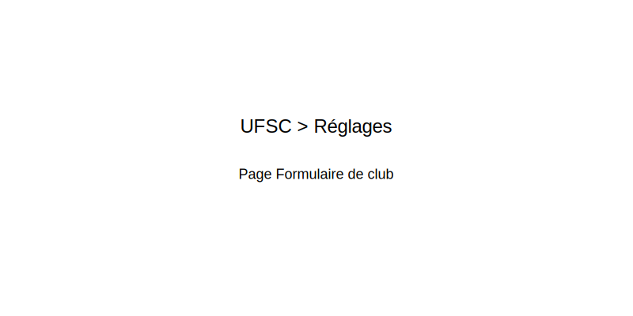

# UFSC - Gestion de Club

**Plugin WordPress professionnel pour la gestion des affiliations et licences UFSC**

[](https://github.com/DavyReactiv/Plugin_UFSC_GESTION_CLUB_13072025)
[](https://wordpress.org)
[](https://php.net)
[](LICENSE)

## 📋 Description

Plugin WordPress complet et professionnel permettant aux clubs UFSC (Union Française des Sports de Combat) de gérer leur affiliation, leurs licenciés et leurs documents administratifs directement depuis WordPress avec une interface moderne et responsive.

### 🎯 Fonctionnalités principales

- **🏢 Gestion complète des clubs** : Profils détaillés avec logo, coordonnées, réseaux sociaux
- **👥 Gestion des licenciés** : Ajout, suivi et statistiques des licences individuelles
- **📊 Statistiques interactives** : Graphiques dynamiques par âge, sexe, fonction
- **💳 Gestion des paiements** : Intégration WooCommerce et coordonnées bancaires UFSC
- **📄 Documents administratifs** : Upload et gestion des attestations
- **🔐 Sécurité renforcée** : Validation des données, protection CSRF
- **📱 Design responsive** : Interface adaptée mobile, tablette et desktop

## 🚀 Installation

### Prérequis techniques

| Composant | Version minimale | Recommandée |
|-----------|------------------|-------------|
| WordPress | 5.5+ | 6.0+ |
| PHP | 7.4+ | 8.1+ |
| MySQL | 5.6+ | 8.0+ |
| WooCommerce | 4.0+ | 7.0+ (optionnel) |

### Installation du plugin

1. **Téléchargement**
   ```bash
   # Via l'interface WordPress
   Extensions > Ajouter > Téléverser > Sélectionner le fichier ZIP
   ```

2. **Activation**
   ```bash
   Extensions > Extensions installées > UFSC Gestion Club > Activer
   ```

3. **Configuration initiale**
   - Les tables de base de données sont créées automatiquement
   - Configurez les pages dans `UFSC > Réglages`
   - Définissez les permissions utilisateurs
   - Un message est enregistré dans les logs PHP si le fichier `includes/frontend/frontend-club-dashboard.php` est manquant, afin de faciliter le diagnostic d'une installation incomplète

## ⚙️ Configuration

### Pages WordPress requises

**🆕 Depuis la v1.3.0 :** Les pages sont créées automatiquement lors de l'activation du plugin !

Le plugin utilise des pages WordPress dédiées pour l'interface frontend. Ces pages sont maintenant créées automatiquement avec les shortcodes appropriés :

| Page | Shortcode | URL | Description |
|------|-----------|-----|-------------|
| **Tableau de Bord Club** | `[ufsc_club_dashboard]` | `/tableau-de-bord-club/` | Espace privé des clubs affiliés |
| **Affiliation Club** | `[ufsc_affiliation_form]` | `/affiliation-club/` | Formulaire d'affiliation |
| **Formulaire de Club** | `[ufsc_formulaire_club]` | `/formulaire-club/` | Création ou modification du club |
| **Compte Club** | `[ufsc_club_account]` | `/compte-club/` | Gestion du compte club |
| **Gestion des Licences** | `[ufsc_club_licences]` | `/gestion-licences/` | Gestion des licences du club |
| **Ajouter un Licencié** | `[ufsc_ajouter_licencie]` | `/ajouter-licencie/` | Ajout de licenciés |
| **Demander une Licence** | `[ufsc_licence_button]` | `/demander-licence/` | Demande de nouvelle licence |
| **Attestations** | `[ufsc_attestation_form]` | `/attestations-club/` | Upload d'attestations |
| **Liste des Clubs** | `[ufsc_liste_clubs]` | `/liste-clubs/` | Liste publique des clubs |
| **Connexion Club** | `[ufsc_login_register]` | `/connexion-club/` | Connexion et inscription |
| **Liste des Clubs** | `[ufsc_liste_clubs]` | `/liste-clubs/` | Liste publique des clubs |

Les pages sont créées automatiquement avec des permaliens optimisés. Vous pouvez les personnaliser dans `Pages > Toutes les pages`.


### Formulaire de club

L'option `ufsc_club_form_page_id` permet de définir la page WordPress qui héberge le formulaire de création ou d'édition de club. Cette page doit contenir le shortcode `[ufsc_formulaire_club]`.

Configurez cette page dans l'interface d'administration : `UFSC > Réglages > Configuration des pages`.


=======
> ℹ️ Si aucune page "Formulaire Club" n'est configurée, le bouton "Créer un club" du tableau de bord redirige automatiquement vers la page d'affiliation.

### Shortcodes disponibles

#### Navigation et interface (v1.3.0)
- `[ufsc_club_menu]` : **Menu de navigation club** - Affiche un menu responsive pour les utilisateurs club connectés
  - Sécurisé : visible uniquement pour les utilisateurs connectés avec un club associé
  - Responsive : s'adapte automatiquement aux écrans mobiles et tablettes
  - Navigation automatique vers toutes les pages club configurées

#### Nouveaux shortcodes frontend (v1.3.0)
- `[ufsc_login_register]` - Formulaire de connexion et inscription avec redirection automatique
- `[ufsc_recent_licences limit="5"]` - Widget affichant les dernières licences du club
- `[ufsc_club_menu show_logout="yes" show_buy="auto"]` - Menu de navigation avec déconnexion et badge inactif

#### Shortcodes existants (v1.2.1)
- `[ufsc_club_register]` - Formulaire d'enregistrement/affiliation de club sécurisé
- `[ufsc_club_account]` - Interface de gestion du compte club
- `[ufsc_club_licenses]` - Gestion complète des licences du club
- `[ufsc_club_dashboard]` - Dashboard moderne avec statistiques et actions rapides

#### Gestion des clubs
- `[ufsc_formulaire_affiliation]` - Formulaire d'affiliation (nouveau club)
- `[ufsc_club_form]` - Formulaire de création/édition de club
- `[ufsc_liste_clubs]` - Liste publique des clubs affiliés
- `[ufsc_club_infos]` - Informations du club (avec paramètre id)

#### Gestion des licences
- `[ufsc_formulaire_licence]` - Formulaire d'ajout de licencié
- `[ufsc_licence_list]` - Liste des licences du club connecté
- `[ufsc_licence_stats]` - Statistiques des licences avec graphiques

#### Documents et attestations
- `[ufsc_attestations]` - Interface d'upload d'attestations
- `[ufsc_documents_club]` - Gestion des documents du club

#### Paramètres des shortcodes
Certains shortcodes acceptent des paramètres :

```php
// Afficher les infos d'un club spécifique
[ufsc_club_infos id="123"]

// Limiter le nombre de clubs affichés
[ufsc_liste_clubs limit="10"]

// Afficher seulement les clubs d'une région
[ufsc_liste_clubs region="ile-de-france"]

// Widget des licences récentes
[ufsc_recent_licences limit="3" show_link="yes"]

// Menu club avec options
[ufsc_club_menu show_logout="yes" show_buy="auto"]

// Formulaire de connexion avec redirection
[ufsc_login_register redirect="/tableau-de-bord/" show_register="auto"]
```

### Configuration post-activation

1. **Accéder aux réglages** : `UFSC > Réglages` dans l'admin WordPress
2. **Associer les pages** : Sélectionnez les pages créées avec les shortcodes
3. **Configurer WooCommerce** (optionnel) : Définir les IDs des produits
4. **Permissions utilisateurs** : Vérifier les rôles et capacités

### Configuration WooCommerce (optionnel)

Pour l'achat de licences et affiliations en ligne :

#### Configuration des produits
1. **Créez les produits WooCommerce** :
   - Produit "Affiliation Club UFSC" - ID recommandé : 4823
   - Produit "Licence UFSC" - ID recommandé : 2934

2. **Configuration via les réglages** :
   - Allez dans `UFSC > Réglages > WooCommerce`
   - Sélectionnez les produits dans les listes déroulantes
   - Ou définissez manuellement les IDs

3. **Configuration manuelle** (alternative) :
   ```php
   // Dans wp-config.php ou functions.php de votre thème
   add_action('init', function() {
       update_option('ufsc_wc_affiliation_product_id', 4823);
       update_option('ufsc_wc_license_product_ids', '2934');
   });
   ```

#### Mapping des produits WooCommerce
Le plugin détecte automatiquement les achats via :
- **ID Affiliation** : `ufsc_wc_affiliation_product_id` (fallback: 4823)
- **ID Licence(s)** : `ufsc_wc_license_product_ids` (fallback: 2934)

Les options peuvent être configurées via :
- Interface d'administration UFSC
- Options WordPress `ufsc_wc_affiliation_product_id` et `ufsc_wc_license_product_ids`
- Constantes PHP (pour développeurs)

#### Intégration automatique
Le plugin s'intègre aux hooks WooCommerce :
- `woocommerce_order_status_completed` - Commande terminée
- `woocommerce_payment_complete` - Paiement validé

Les licences multiples sont créées automatiquement selon la quantité achetée.

## 📚 Guide d'utilisation

### Pour les administrateurs

#### Gestion des clubs
- **Validation** : `UFSC > Clubs` pour valider les nouvelles affiliations
- **Documents** : Vérification des statuts, récépissés, PV d'AG
- **Utilisateurs** : Association clubs ↔ utilisateurs WordPress

#### Statistiques globales
- **Dashboard** : Vue d'ensemble et métriques
- **Rapports** : Export et analyse des données
- **Monitoring** : Suivi des activités et logs

### Pour les clubs

#### Profil club enrichi
- **Logo** : Upload d'image (JPG, PNG, max 2MB)
- **Coordonnées** : Adresse complète, téléphone, email
- **Web & Réseaux** : Site internet, Facebook, Instagram
- **Légal** : SIREN, RNA, IBAN (si gestion paiements)

#### Gestion des licences
- **Ajout** : Formulaire complet avec toutes les informations
- **Suivi** : Statuts, dates d'expiration, renouvellements
- **Statistiques** : Graphiques interactifs par âge, sexe, fonction

#### Paiements et facturation
- **Coordonnées UFSC** : IBAN, BIC, références obligatoires
- **Historique** : Suivi des paiements et factures
- **Alertes** : Notifications pour les échéances

## 🎨 Interface et design

### Nouveautés v1.1.0

- **🎯 Design moderne** : Interface professionnelle avec CSS Grid/Flexbox
- **📊 Graphiques interactifs** : Charts en JavaScript natif (sans CDN)
- **💳 Informations bancaires** : Coordonnées UFSC officielles mises à jour
- **📱 Responsive design** : Expérience optimisée sur tous appareils
- **🔧 Formulaires enrichis** : Sections organisées, upload de logo

### Thème et personnalisation

Le plugin utilise les couleurs officielles UFSC :
- **Bleu UFSC** : `#2e2d54`
- **Rouge UFSC** : `#d40000`
- **Interface** : Tons neutres modernes

## 🔧 Développement

### Structure du projet

```
Plugin_UFSC_GESTION_CLUB_13072025/
├── 📁 assets/                    # Ressources frontend
│   ├── 📁 css/                   # Styles CSS
│   └── 📁 js/                    # Scripts JavaScript
├── 📁 includes/                  # Code PHP principal
│   ├── 📁 admin/                 # Interface d'administration
│   ├── 📁 clubs/                 # Gestion des clubs
│   ├── 📁 frontend/              # Interface utilisateur
│   ├── 📁 licences/              # Gestion des licences
│   └── 📁 shortcodes/            # Shortcodes WordPress
├── 📁 data/                      # Données de configuration
└── 📄 Plugin_UFSC_GESTION_CLUB_13072025.php  # Fichier principal
```

### API et hooks

Le plugin expose plusieurs hooks pour l'extensibilité :

```php
// Actions
do_action('ufsc_club_created', $club_id, $club_data);
do_action('ufsc_club_validated', $club_id);
do_action('ufsc_licence_added', $licence_id, $club_id);

// Filtres
$club_data = apply_filters('ufsc_club_data_validation', $club_data);
$stats = apply_filters('ufsc_club_statistics', $stats, $club_id);
```

### Base de données

Tables créées automatiquement :
- `wp_ufsc_clubs` : Données des clubs
- `wp_ufsc_licences` : Licences individuelles

## 🔐 Sécurité

### Mesures implémentées

- ✅ **Validation des données** : Sanitization et validation server-side
- ✅ **Protection CSRF** : Nonces WordPress sur tous les formulaires
- ✅ **Upload sécurisé** : Types de fichiers contrôlés, taille limitée
- ✅ **Accès contrôlé** : Vérification des permissions et propriétés
- ✅ **Logs d'activité** : Traçabilité des actions importantes

### Bonnes pratiques

```php
// Exemple de validation sécurisée
if (wp_verify_nonce($_POST['nonce'], 'ufsc_action')) {
    $data = sanitize_text_field($_POST['data']);
    // Traitement sécurisé...
}
```

## 🐛 Dépannage

### Problèmes fréquents

| Problème | Solution |
|----------|----------|
| Boutons inactifs | Vérifier la configuration des pages dans Réglages |
| Erreur d'upload | Contrôler les permissions fichiers et taille max |
| Club non trouvé | Vérifier l'association utilisateur-club |
| Problème CSS | Vider le cache et vérifier l'enqueue des styles |

### Debug et logs

Activez le mode debug WordPress :
```php
define('WP_DEBUG', true);
define('WP_DEBUG_LOG', true);
```

Les logs UFSC sont disponibles dans l'interface d'administration.

## 🔧 Corrections récentes : Formulaire de licence front-end

### Problèmes corrigés (Janvier 2025)

**1. Erreur de sécurité lors de l'ajout de licencié**
- ✅ **Correction message d'erreur** : Le message "Erreur de sécurité. Veuillez recharger la page." affiché lors de champs manquants a été remplacé par "Champs obligatoires manquants" plus précis.
- ✅ **Nonce WordPress** : La vérification de sécurité fonctionne correctement avec `wp_verify_nonce`.
- ✅ **Workflow AJAX** : Le formulaire redirige vers le panier WooCommerce sans blocage.

**2. Harmonisation formulaire front-end avec WooCommerce**
- ✅ **Champs complets** : Le formulaire front-end inclut maintenant tous les champs du formulaire WooCommerce
- ✅ **Adresse complète** : Ajout du champ "Complément d'adresse" (suite_adresse)
- ✅ **Téléphones séparés** : Division en "Téléphone fixe" et "Téléphone mobile"
- ✅ **Informations supplémentaires** : Profession, Identifiant La Poste, Région (avec liste déroulante)
- ✅ **13 options à cocher** : Réductions, permissions, assurances organisées en sections logiques
- ✅ **Champs spécialisés** : N° licence délégataire, Note (textarea)

**3. Validation et design**
- ✅ **Validation front et back** : Tous les champs sont validés côté client et serveur
- ✅ **Responsive design** : Formulaire adapté aux mobiles avec grilles CSS
- ✅ **Cohérence graphique** : Utilise le framework CSS existant du plugin
- ✅ **Workflow cart** : Les données transitent correctement du formulaire au panier WooCommerce

### Procédure de test recommandée

1. **Test de sécurité**
   ```
   - Aller sur le formulaire d'ajout de licencié front-end
   - Soumettre le formulaire avec des champs vides
   - Vérifier que le message affiché est "Champs obligatoires manquants"
   ```

2. **Test des champs**
   ```
   - Vérifier la présence de tous les champs WooCommerce
   - Tester la sélection de région (dropdown)
   - Cocher/décocher les options diverses
   - Saisir une note dans la zone de texte
   ```

3. **Test du workflow complet**
   ```
   - Remplir tous les champs obligatoires
   - Cliquer "Ajouter au panier"
   - Vérifier la redirection vers le panier WooCommerce
   - Confirmer que les données apparaissent dans le panier
   - Finaliser la commande et vérifier les métadonnées
   ```

4. **Test responsive**
   ```
   - Tester sur mobile (< 768px)
   - Vérifier que les grilles deviennent verticales
   - S'assurer que tous les champs restent accessibles
   ```

## 📈 Changelog

### Version 1.2.2 (Janvier 2025) - Amélioration Attestations et Corrections UX
- ✅ **Attestations avec WordPress Media Library** : Intégration complète wp.media pour téléversement
- ✅ **Nouveaux boutons "Voir"** : Prévisualisation PDF/images directement dans l'admin et frontend
- ✅ **Helper functions attestations** : API unifiée avec `ufsc_get_club_attestation_url()`
- ✅ **Système d'attachments WordPress** : Migration des URLs vers attachments avec rétrocompatibilité
- ✅ **CSS admin responsive** : Correction largeur tables licenciés + nouvelles classes `.ufsc-admin-table-wrapper`
- ✅ **Compatibilité MoneticoPaiement** : Filtre notices deprecated properties sans masquer autres erreurs
- ✅ **Corrections schéma BDD** : Foreign keys `fk_licence_club` et types `MEDIUMINT(9) UNSIGNED` harmonisés
- ✅ **Script enqueuing amélioré** : Détection pages UFSC plus précise pour chargement assets
- ✅ **Tests fonctionnels** : Suite de tests pour nouvelles fonctions helper et endpoints AJAX

### Version 1.2.1 (Janvier 2025) - Correctifs de Sécurité et Intégrations
- ✅ **Intégration WooCommerce centralisée** : Nouvelle classe unifiée pour gestion des commandes
- ✅ **Shortcodes frontend sécurisés** : Nouveaux shortcodes avec nonces et sanitization
- ✅ **CSS responsive moderne** : Framework CSS mobile-first avec accessibilité
- ✅ **Désinstallation complète** : Cleanup des options WooCommerce et données plugin
- ✅ **Sécurité renforcée** : Correction de vulnérabilité SQL injection dans admin-club-list.php
- ✅ **Vérifications d'accès** : Contrôles de capacités ajoutés aux handlers AJAX
- ✅ **Internationalisation** : Infrastructure i18n complète avec fichiers .pot/.po
- ✅ **Échappement des sorties** : Amélioration de l'échappement dans JavaScript inline
- ✅ **Messages utilisateur** : Tous les messages d'erreur traduits avec __()
- ✅ **Notice d'activation** : Guide post-activation pour configuration initiale
- ✅ **Requêtes préparées** : Audit et correction des requêtes SQL non préparées

## 🔒 Sécurité et Bonnes Pratiques

### Mesures de sécurité implémentées
- **Nonces WordPress** : Protection CSRF sur tous les formulaires
- **Sanitization** : Nettoyage de toutes les entrées utilisateur
- **Échappement** : Sécurisation des sorties HTML/JS
- **Capacités utilisateur** : Vérification des permissions avant actions
- **Requêtes préparées** : Protection contre les injections SQL
- **Validation** : Contrôles côté client et serveur

## 🔧 Compatibilité & Dépréciations

### Compatibilité Plugin Tiers
Le plugin inclut des shims de compatibilité pour réduire les conflicts avec d'autres plugins :

- **MoneticoPaiement** : Filtre automatique des notices de propriétés dynamiques dépréciées
  - `MoneticoPaiement::$monetico_code_site_payment_display_method`
  - Autres notices E_DEPRECATED du plugin restent masquées
  - Les autres erreurs PHP restent visibles normalement

### Gestion des Attestations
Le système d'attestations supporte deux modes :

```php
// Nouveau système (recommandé) - WordPress Attachments
$attachment_id = ufsc_club_get_attestation_attachment_id($club_id, 'affiliation');
$url = wp_get_attachment_url($attachment_id);

// Ancien système (maintenu pour compatibilité) - URLs directes  
$url = get_post_meta($club_id, '_ufsc_attestation_affiliation', true);

// API unifiée (utilise automatiquement le meilleur)
$url = ufsc_get_club_attestation_url($club_id, 'affiliation');
```

### Migration Automatique
- Les anciennes attestations restent fonctionnelles
- Les nouveaux téléversements utilisent le système d'attachments WordPress
- Migration transparente lors de la première modification admin

### Configuration sécurisée
```php
// Désactiver les fonctionnalités pro si nécessaire
define('UFSC_DISABLE_FRONTEND_PRO', true);

// Mode licence WooCommerce uniquement
define('UFSC_LICENCE_MODE', 'woocommerce');

// Répertoire uploads sécurisé
$upload_dir = wp_upload_dir();
// Le plugin créé automatiquement ufsc-documents/ avec .htaccess
```

### Déploiement rapide
1. **Sauvegarde** : Backup base de données et fichiers
2. **Upload** : Plugin via FTP ou interface WordPress
3. **Activation** : Automatique avec création des tables
4. **Configuration** : Pages et produits WooCommerce via admin
5. **Test** : Vérification des shortcodes et intégrations
6. **Mise en production** : Validation finale des workflows

### Monitoring recommandé
- Logs d'erreurs PHP pour détecter les problèmes
- Surveillance des commandes WooCommerce
- Vérification périodique des permissions utilisateurs
- Tests réguliers des formulaires frontend

### Version 1.2.0 (Janvier 2025)
- ✅ **Page de réglages graphique** : Interface moderne pour lier les pages clés (espace club, licences, affiliation, attestations) et les produits WooCommerce
- ✅ **Sélection graphique des IDs produits** : Choix visuel des produits WooCommerce (Affiliation ID 4823, Licence ID 2934)
- ✅ **Workflow de licences amélioré** : Processus brouillon > paiement WooCommerce > validation admin
- ✅ **Design harmonisé** : Accessibilité, responsive et sécurité accrue sur l'administration et le front-end
- ✅ **Gestion des documents via médiathèque** : Intégration native WordPress pour les documents clubs
- ✅ **Documentation interne enrichie** : Guides et aide contextuelle pour les administrateurs
- ✅ **Expérience professionnelle** : Interface graphique, sécurisée et pratique pour admins et utilisateurs

### Version 1.1.1 (Janvier 2025)
- ✅ **Correction critique** : Erreur "Sécurité" lors ajout licencié front-end
- ✅ **Harmonisation formulaires** : Front-end aligné sur WooCommerce (tous champs)
- ✅ **Workflow fiabilisé** : Redirection panier sans blocage
- ✅ **Design unifié** : Responsive et cohérent graphiquement
- ✅ **Tests automatiques** : Validation harmonisation formulaires

### Version 1.1.0
- ✅ **Correction CSS** : Fichier woocommerce-custom.css corrigé
- ✅ **Profil enrichi** : Logo, réseaux sociaux, SIREN, RNA, IBAN
- ✅ **Statistiques dynamiques** : Graphiques interactifs age/sexe/fonction
- ✅ **Paiements UFSC** : Coordonnées bancaires officielles mises à jour
- ✅ **Design responsive** : Interface mobile/tablette optimisée
- ✅ **Documentation** : README professionnel et guides complets

### Version 1.0.2
- ✅ Correction des boutons inactifs
- ✅ Résolution des crashes WooCommerce
- ✅ Amélioration de la robustesse
- ✅ Compatibilité PHP 8.2+

## 🤝 Support et contribution

### Support technique

- **Documentation** : Consultez ce README, les guides intégrés, et le [Guide de style](assets/docs/style-guide.md)
- **Logs** : Activez le debug pour diagnostiquer les problèmes
- **Tests** : Le plugin inclut des tests automatiques (mode debug)

### Contribution

1. Fork le projet
2. Créez une branche feature (`git checkout -b feature/amelioration`)
3. Committez vos changes (`git commit -am 'Ajout nouvelle fonctionnalité'`)
4. Push vers la branche (`git push origin feature/amelioration`)
5. Créez une Pull Request

### Exécution des tests

Pour exécuter les tests unitaires :

```bash
phpunit --testsuite core
```

## 🔐 Nonces Frontend

| Action | Nonce | Vérification |
| --- | --- | --- |
| Ajout d'un licencié au panier | `ufsc_add_licencie_nonce` | `check_ajax_referer` |
| Brouillons de licence / quota | `ufsc_front_nonce` | `check_ajax_referer` |
| Liste des licences (actions directes) | `ufscx_licences` | `check_ajax_referer` |
| Téléversement du logo de club | `ufsc_set_club_logo_nonce` | `check_ajax_referer` |
| Formulaire d'affiliation | `ufsc_affiliation_nonce` | `check_ajax_referer` |
| Soumission du formulaire licence | `ufsc_add_licence_nonce` | `check_admin_referer` |
| Ajout de licence au panier | `ufsc_add_licence_to_cart` | `check_ajax_referer` |

## 📄 Licence

Ce plugin est distribué sous licence GPL-2.0+. Voir le fichier [LICENSE](LICENSE) pour plus de détails.

---

**Développé avec ❤️ pour la communauté UFSC**

*Plugin officiel de l'Union Française des Sports de Combat*